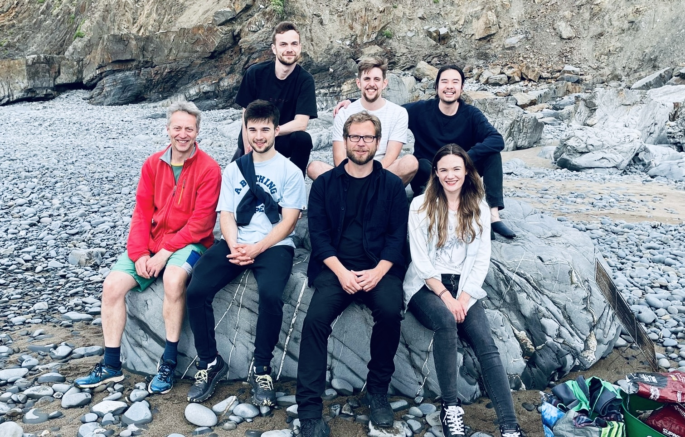

# Meet the team

&nbsp;

&nbsp;

##### Current team members 

---

::::{grid} 2
:gutter: 5

:::{grid-item-card}
:link: members/jackmellor
:link-type: doc

**Jack Mellor**
^^^

**`Jack Mellor`**  
_Principle investigator_  
<!--[<i class="fa-brands fa-twitter fa-lg" style="color:#2a67cf"></i>](https://www.twitter.com)-->
<!--[<i class="fa-brands fa-linkedin-in fa-lg" style="color:#5a97d8"></i>](https://www.linkedin.com)-->
<!--[<i class="fa-brands fa-researchgate" style="color: #57dba8;"></i>](https://www.researchgate.com)-->
[<i class="fa-brands fa-orcid" style="color: #6eee5d;"></i>](https://orcid.org/0000-0002-7706-8105)
[<i class="fa-brands fa-github" style="color: #696969;"></i>](https://www.github.com/mellor-lab)
[<i class="fa-solid fa-building-columns" style="color: #d74242;"></i>](https://www.bristol.ac.uk/people/person/Jack-Mellor-72952ade-4a8b-4c91-8a8e-d7bea0689832/)
[<i class="fa-solid fa-envelope"></i>](mailto:USERNAME@ORGANIZATION.NET)

:::
::::

---

## Postdocs

::::{grid} 2
:gutter: 5

:::{grid-item-card}
:link: members/mattudakis
:link-type: doc

**Matt Udakis**
^^^

**`Matt Udakis`**  
_Senior Research Associate_  
[<i class="fa-brands fa-twitter fa-lg" style="color:#2a67cf"></i>](https://twitter.com/matt_youdaykiss?lang=en-GB)
[<i class="fa-brands fa-linkedin-in fa-lg" style="color:#5a97d8"></i>](https://www.linkedin.com/in/matt-udakis-21070485/?originalSubdomain=uk)
[<i class="fa-brands fa-researchgate" style="color: #57dba8;"></i>](https://www.researchgate.net/profile/Matt-Udakis)
[<i class="fa-brands fa-github" style="color: #696969;"></i>](https://www.github.com/mattudakis)
[<i class="fa-solid fa-building-columns" style="color: #d74242;"></i>](https://research-information.bris.ac.uk/en/persons/matt-udakis)
[<i class="fa-solid fa-envelope"></i>](mailto:USERNAME@ORGANIZATION.NET)
<!--[<i class="fa-brands fa-orcid" style="color: #6eee5d;"></i>](https://www.orcid.org)-->

:::

:::{grid-item-card}
:link: members/martynasdervinis
:link-type: doc

**Martynas Dervinis**
^^^

**`Martynas Dervinis`**  
_Research Associate_  
[<i class="fa-brands fa-twitter fa-lg" style="color:#2a67cf"></i>](https://www.twitter.com)
[<i class="fa-brands fa-linkedin-in fa-lg" style="color:#5a97d8"></i>](https://www.linkedin.com)
[<i class="fa-brands fa-researchgate" style="color: #57dba8;"></i>](https://www.researchgate.com)
[<i class="fa-brands fa-orcid" style="color: #6eee5d;"></i>](https://www.orcid.org)
[<i class="fa-brands fa-github" style="color: #696969;"></i>](https://www.github.com)
[<i class="fa-solid fa-building-columns" style="color: #d74242;"></i>](http://www.bristol.ac.uk/phys-pharm-neuro/)
[<i class="fa-solid fa-envelope"></i>](mailto:USERNAME@ORGANIZATION.NET)

:::

::::

## PhD Students

::::{grid} 2
:gutter: 5

:::{grid-item-card}
:link: members/hengweizhu
:link-type: doc

**Heng Wei Zhu** 
^^^
 

**`Heng Wei Zhu`**  
_PhD Student_  
[<i class="fa-brands fa-twitter fa-lg" style="color:#2a67cf"></i>](https://www.twitter.com)
[<i class="fa-brands fa-linkedin-in fa-lg" style="color:#5a97d8"></i>](https://www.linkedin.com)
[<i class="fa-brands fa-researchgate" style="color: #57dba8;"></i>](https://www.researchgate.com)
[<i class="fa-brands fa-orcid" style="color: #6eee5d;"></i>](https://www.orcid.org)
[<i class="fa-brands fa-github" style="color: #696969;"></i>](https://www.github.com)
[<i class="fa-solid fa-building-columns" style="color: #d74242;"></i>](http://www.bristol.ac.uk/phys-pharm-neuro/)
[<i class="fa-solid fa-envelope"></i>](mailto:USERNAME@ORGANIZATION.NET)

:::

:::{grid-item-card}
:link: members/dangoodwin
:link-type: doc

**Dan Goodwin** 
^^^

**`Dan Goodwin`**  
_PhD Student_  
[<i class="fa-brands fa-twitter fa-lg" style="color:#2a67cf"></i>](https://www.twitter.com)
[<i class="fa-brands fa-linkedin-in fa-lg" style="color:#5a97d8"></i>](https://www.linkedin.com)
[<i class="fa-brands fa-researchgate" style="color: #57dba8;"></i>](https://www.researchgate.com)
[<i class="fa-brands fa-orcid" style="color: #6eee5d;"></i>](https://www.orcid.org)
[<i class="fa-brands fa-github" style="color: #696969;"></i>](https://www.github.com)
[<i class="fa-solid fa-building-columns" style="color: #d74242;"></i>](http://www.bristol.ac.uk/phys-pharm-neuro/)
[<i class="fa-solid fa-envelope"></i>](mailto:USERNAME@ORGANIZATION.NET)

:::

:::{grid-item-card}
:link: members/joeflanagan
:link-type: doc

**Joe Flanagan** 
^^^

**`Joe Flanagan`**  
_PhD Student_  
[<i class="fa-brands fa-twitter fa-lg" style="color:#2a67cf"></i>](https://www.twitter.com)
[<i class="fa-brands fa-linkedin-in fa-lg" style="color:#5a97d8"></i>](https://www.linkedin.com)
[<i class="fa-brands fa-researchgate" style="color: #57dba8;"></i>](https://www.researchgate.com)
[<i class="fa-brands fa-orcid" style="color: #6eee5d;"></i>](https://www.orcid.org)
[<i class="fa-brands fa-github" style="color: #696969;"></i>](https://www.github.com)
[<i class="fa-solid fa-building-columns" style="color: #d74242;"></i>](http://www.bristol.ac.uk/phys-pharm-neuro/)
[<i class="fa-solid fa-envelope"></i>](mailto:USERNAME@ORGANIZATION.NET)

:::

::::