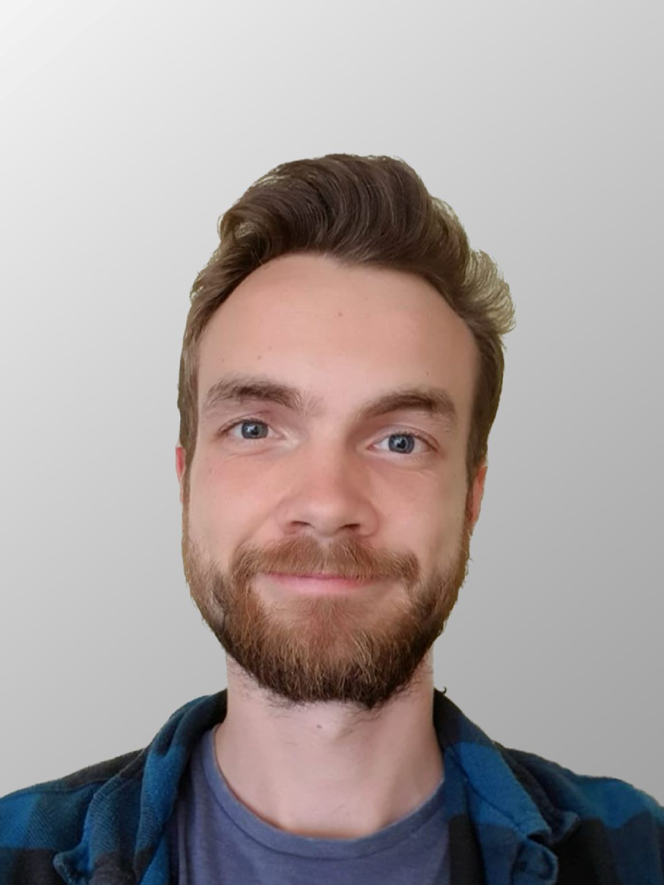

# Meet the team

&nbsp;

&nbsp;

##### Current team members

---

::::{grid} 1 2 2 2
:gutter: 5

:::{grid-item-card}
:link: members/jackmellor
:link-type: doc

**Jack Mellor**
^^^

**`Jack Mellor`**  
_Principle Investigator_  

:::
::::

---

## Postdocs

::::{grid} 1 2 2 2
:gutter: 5

:::{grid-item-card}
:link: members/mattudakis
:link-type: doc

**Matt Udakis**
^^^

**`Matt Udakis`**  
_Senior Research Associate_  

<!--[<i class="fa-brands fa-orcid" style="color: #6eee5d;"></i>](https://www.orcid.org)-->

:::

:::{grid-item-card}
:link: members/jithinnair
:link-type: doc

**Jithin Nair**
^^^

**`Jithin Nair`**  
_Research Associate_  

:::

::::

---

## PhD Students

::::{grid} 1 2 2 2
:gutter: 5

:::{grid-item-card}
:link: members/hengweizhu
:link-type: doc

**Heng Wei Zhu** 
^^^

**`Heng Wei Zhu`**  
_PhD Student_  

:::

:::{grid-item-card}
:link: members/dangoodwin
:link-type: doc

**Dan Goodwin** 
^^^

**`Dan Goodwin`**  
_PhD Student_  

:::

:::{grid-item-card}
:link: members/joeflanagan
:link-type: doc

**Joe Flanagan** 
^^^

**`Joe Flanagan`**  
_PhD Student_  

:::

:::{grid-item-card}
:link: members/elsaoakes
:link-type: doc

**Elsa Oakes** 
^^^

**`Elsa Oakes`**  
_PhD Student_  

:::

::::

&nbsp;

