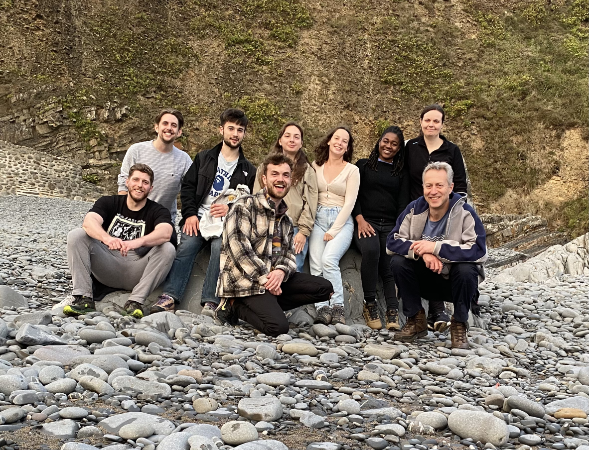
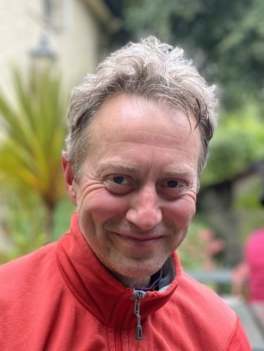
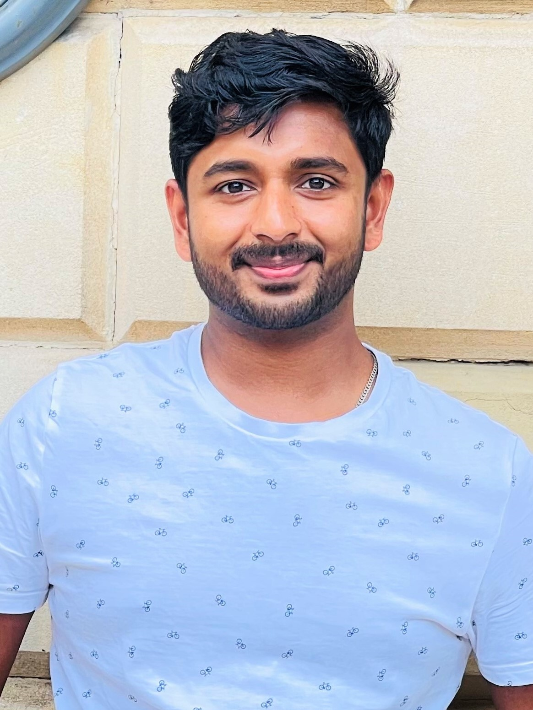
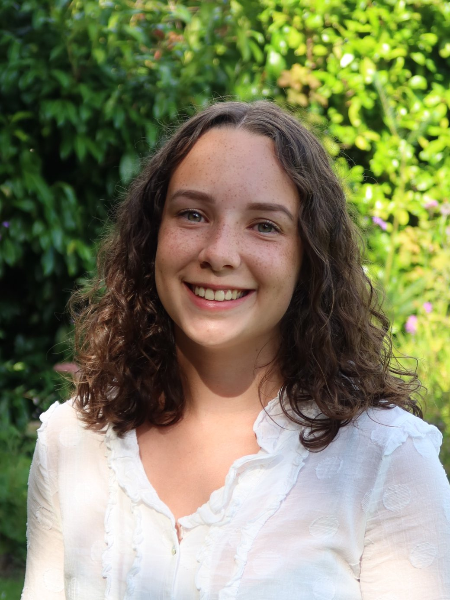
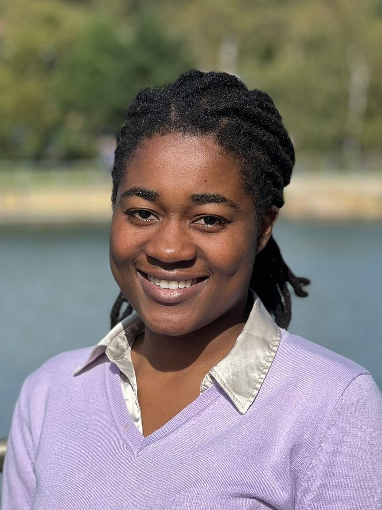

# Meet the team

&nbsp;

&nbsp;

##### Current team members

---

::::{grid} 1 2 2 2
:gutter: 5

:::{grid-item-card}
:link: members/jackmellor
:link-type: doc

**Jack Mellor**
^^^

**`Jack Mellor`**  
_Principle Investigator_  

:::
::::

---

## Postdocs

::::{grid} 1 2 2 2
:gutter: 5

:::{grid-item-card}
:link: members/lauraalberio
:link-type: doc

**Laura Alberio**
^^^

**`Laura Alberio`**  
_Senior Research Associate_  

:::

:::{grid-item-card}
:link: members/mattclaydon
:link-type: doc

**Matt Claydon**
^^^

**`Matt Claydon`**  
_Senior Research Associate_  

:::

:::{grid-item-card}
:link: members/jithinnair
:link-type: doc

**Jithin Nair**
^^^

**`Jithin Nair`**  
_Research Associate_  

:::

::::

---

## PhD Students

::::{grid} 1 2 2 2
:gutter: 5

:::{grid-item-card}
:link: members/joeflanagan
:link-type: doc

**Joe Flanagan** 
^^^

**`Joe Flanagan`**  
_PhD Student_  

:::

:::{grid-item-card}
:link: members/dangoodwin
:link-type: doc

**Dan Goodwin** 
^^^

**`Dan Goodwin`**  
_PhD Student_  

:::

:::{grid-item-card}
:link: members/elsaoakes
:link-type: doc

**Elsa Oakes** 
^^^

**`Elsa Oakes`**  
_PhD Student_  

:::

::::

---

## Research Technicians

::::{grid} 1 2 2 2
:gutter: 5

:::{grid-item-card}
:link: members/shylinebajaba
:link-type: doc

**Shyline Bajaba** 
^^^

**`Shyline Bajaba`**  
_Research Technician_  

:::

::::

&nbsp;

