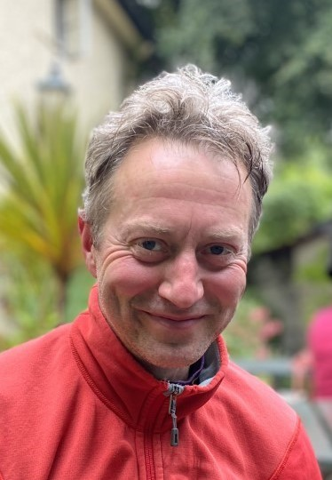

# Jack Mellor





&nbsp;


**`Jack Mellor`**  
_Principle investigator_  
<!--[<i class="fa-brands fa-twitter fa-lg" style="color:#2a67cf"></i>](https://www.twitter.com)-->
<!--[<i class="fa-brands fa-linkedin-in fa-lg" style="color:#5a97d8"></i>](https://www.linkedin.com)-->
<!--[<i class="fa-brands fa-researchgate" style="color: #57dba8;"></i>](https://www.researchgate.com)-->
[<i class="fa-brands fa-orcid" style="color: #6eee5d;"></i>](https://orcid.org/0000-0002-7706-8105)
[<i class="fa-brands fa-github" style="color: #696969;"></i>](https://www.github.com/mellor-lab)
[<i class="fa-solid fa-building-columns" style="color: #d74242;"></i>](https://www.bristol.ac.uk/people/person/Jack-Mellor-72952ade-4a8b-4c91-8a8e-d7bea0689832/)
[<i class="fa-solid fa-envelope"></i>](mailto:USERNAME@ORGANIZATION.NET)


I graduated from the University of Cambridge in 1995 with a degree in Neurophysiology and stayed in Cambridge to study for a PhD on the biophysics and pharmacology of inhibitory synaptic transmission at the MRC Laboratory of Molecular Biology with Andrew Randall. After completing my graduate work in 1998, I worked briefly on science policy at the UK government before joining Roger Nicoll’s laboratory at the University of California San Francisco working on the mechanisms of synaptic plasticity in the hippocampus. 

In 2002 I returned to the UK and joined the laboratory of John Isaac at the University of Bristol before setting up my own group in 2004 with an MRC funded Career Development Fellowship. 

I now lead a team that collaborates extensively with academic, clinical and industry partners focussing on how hippocampal network function is modified by synaptic plasticity and neuromodulators and how these processes are perturbed in psychiatric and neurological disorders leading to disruptions in cognition.  


&nbsp;


```{admonition} Outside of the lab
:class: note

- I enjoy being taught by my children 
- Exploring the Scottish Highlands
- Surfing (anywhere with waves)
- Rowing boats (anywhere without waves)
- Playing music


``` 

---

&nbsp;


